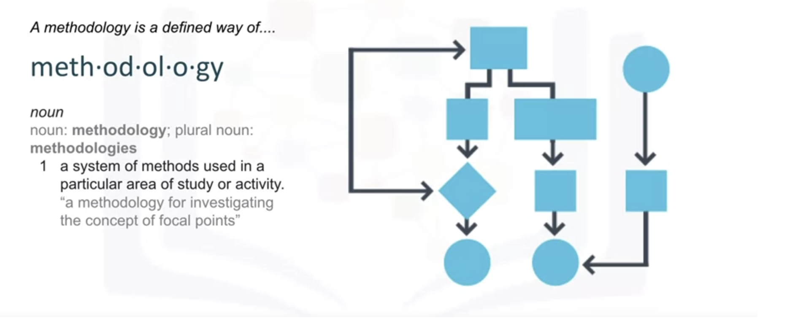

# Data Science Methodology

The first two stages of the data science methodology:
1. Business understanding
2. Analytic approach

**Learn Objectives:**

* List the six key stages of the Cross-Industry Process for Data Mining Methodology
(CRISP-DM), an industry-standard data science methodology.
* Analyze the first four phases of CRISP-DM.
* Apply the first four phases of the data science methodology to a case study.
* Write clearly defined questions that address a business problem.
* Analyze a case study to determine data requirements.
* Apply the data science methodology to a case study.
* Determine data content, data formats, and data sources prior to data collection and data preparation phases.
* Create a decision tree to classify outcomes in a case study.
* Identify appropriate data sources to address a business problem.

## Syllabus
### Module 1: From Problem to Approach and from Requirements to Collection
* Business Understanding
* Analytic Approach
* Data Requirements
* Data Collection

### Module 2: From Understanding to Preparation and from Modeling to Evaluation
* Data Understanding
* Data Preparation
* Modeling
* Evaluation

### Module 3: From Deployment to Feedback
* Deployment
* Feedback

### What is a methodology?

  
