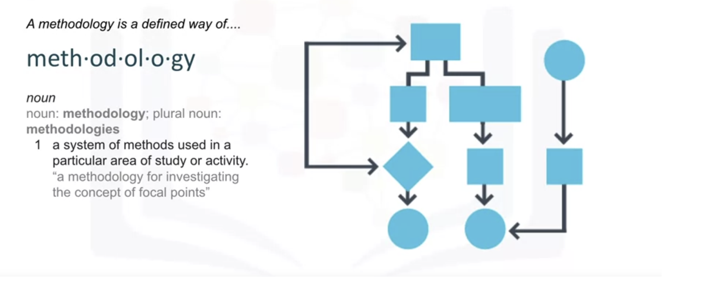
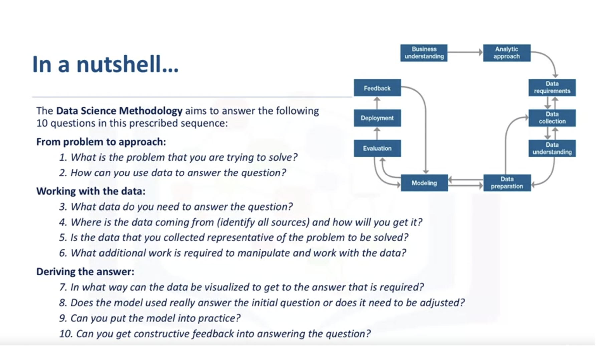
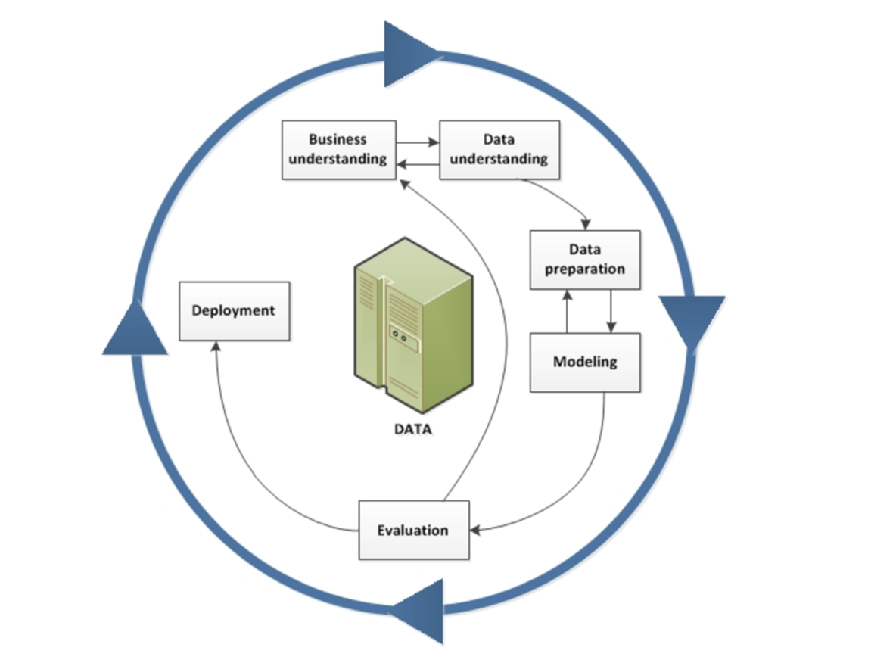

# Data Science Methodology

The first two stages of the data science methodology:
1. Business understanding
2. Analytic approach

**Learn Objectives:**

* List the six key stages of the Cross-Industry Process for Data Mining Methodology
(CRISP-DM), an industry-standard data science methodology.
* Analyze the first four phases of CRISP-DM.
* Apply the first four phases of the data science methodology to a case study.
* Write clearly defined questions that address a business problem.
* Analyze a case study to determine data requirements.
* Apply the data science methodology to a case study.
* Determine data content, data formats, and data sources prior to data collection and data preparation phases.
* Create a decision tree to classify outcomes in a case study.
* Identify appropriate data sources to address a business problem.

## Syllabus
### Module 1: From Problem to Approach and from Requirements to Collection
* Business Understanding
* Analytic Approach
* Data Requirements
* Data Collection

### Module 2: From Understanding to Preparation and from Modeling to Evaluation
* Data Understanding
* Data Preparation
* Modeling
* Evaluation

### Module 3: From Deployment to Feedback
* Deployment
* Feedback

### What is a methodology?

Methodology aims to answer 10 basic questions in a prescribed sequence:

In data mining, the Cross Industry Process for Data Mining (CRISP-DM) methodology is widely used.

### What is CRISP-DM?
The CRISP-DM methodology is a process aimed at increasing the use of data mining over a wide variety of business applications and industries. The intent is to take case-specific scenarios and general behaviors to make them domain-neutral. CRISP-DM is comprised of six steps with an entity that has to be implemented in order to have a reasonable chance of success.

CRISP-DM, which stands for Cross-Industry Standard Process for Data Mining, is an industry-proven way to guide your data mining efforts.

* As a methodology, it includes descriptions of the typical phases of a project, the tasks involved with each phase, and an explanation of the relationships between these tasks.
* As a process model, CRISP-DM provides an overview of the data mining life cycle.

The CRISP-DM model is flexible and can be customized easily. For example, if your organization aims to detect money laundering, you will likely sift through large amounts of data without a specific modeling goal.

Instead of modeling, your work will focus on data exploration and visualization to uncover suspicious patterns in financial data. CRISP-DM allows you to create a data mining model that fits your particular needs.

In such a situation, the modeling, evaluation, and deployment phases might be less relevant than the data understanding and preparation phases. However, it is still important to consider some of the questions raised during these later phases for long-term planning and future data mining goals.

_**1. Business Understanding.**_ This stage is the most important because this is where the intention of the project is outlined. Foundational Methodology and CRISP-DM are aligned here. It requires communication and clarity. The difficulty here is that stakeholders have different objectives, biases, and modalities of relating information. They don't all see the same things or in the same manner. Without a clear, concise, and complete perspective of what the project goals are resources will be needlessly expended.

_**2. Data Understanding.**_ Data understanding relies on business understanding. Data is collected at this stage of the process. The understanding of what the business wants and needs will determine what data is collected, from what sources, and by what methods. CRISP-DM combines the stages of Data Requirements, Data Collection, and Data Understanding from the Foundational Methodology outline.

_**3. Data Preparation.**_ Once the data has been collected, it must be transformed into a usable subset unless it is determined that more data is needed. Once a dataset is chosen, it must then be checked for questionable, missing, or ambiguous cases. Data Preparation is common to CRISP-DM and Foundational Methodology.

_**4. Modeling.**_ Once prepared for use, the data must be expressed through whatever appropriate models, give meaningful insights, and hopefully new knowledge. This is the purpose of data mining: to create knowledge information that has meaning and utility. The use of models reveals patterns and structures within the data that provide insight into the features of interest. Models are selected on a portion of the data and adjustments are made if necessary. Model selection is an art and science. Both Foundational Methodology and CRISP-DM are required for the subsequent stage.
5. Evaluation. The selected model must be tested. This is usually done by having a preselected test, set to run the trained model on. This will allow you to see the effectiveness of the model on a set it sees as new. Results from this are used to determine the efficacy of the model and foreshadow its role in the next and final stage.
_**6. Deployment.**_ In the deployment step, the model is used on new data outside of the scope of the dataset and by new stakeholders. The new interactions at this phase might reveal the new variables and needs for the dataset and model. These new challenges could initiate revision of either business needs and actions, or the model and data, or both.

### From Problem to Approach

